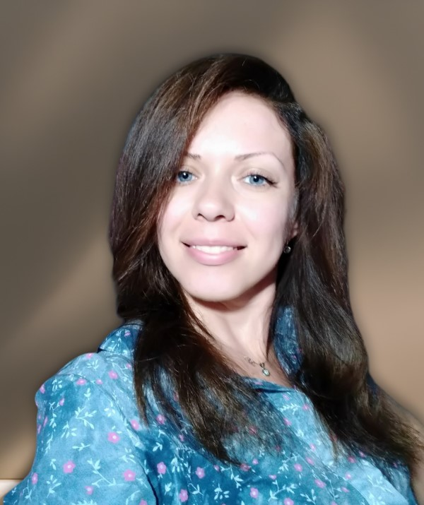

 

 

 
### Контактна інформація:

ПІБ: Нісман Олена Вікторівна;

Адреса: м.Дніпро, вул. Караваєва 1а, кв.10;

Адреса електронної пошти:
elena.nisman85@gmail.com;

Телефон(Viber): +380668189869;

### Про мене

   Привіт, мене звати Олена, я починаючий художник. Мій шлях в світі мистецта розпочався ще в дитинстві, коли в перервах між навчанням 

   
   Мої помічники в самостійному навчанні:) :
- "Секрети і техніки легкого малювання" Енріко Маддалена;
- "Малювання голів та рук" Ендрю Лумісж
- Відео на YouTube;

### Творчі навички:

- Любов до мистецтва та бажання розвиватися в цій сфері.
- Вміння працювати з різними художніми матеріалами (акрилові фарби, олівці, текстурна паста, маркери тощо).
- Здатність візуалізувати ідеї і переносити їх на полотно або папір.
- Творчий підхід до розв'язання завдань і проблем.

### Проєкти і роботи
- O.N. Art House - студія розпису одягу, засновник - https://onarthouse.com/collections/all
- Роботи простим олівцем -
- Роботи акрилом та текстурною пастою - 

### Досвід роботи:

**вересень 2021 р.- липень 2023р. - Художник, власна справа**
*Обов'язки:* розпис одягу акриловими фарбами, маркерами.
*Придбані навички:* малювання людей/тварин, робота з акриловими фарбами/маркерами.

**листопад 2014 г. – вересень 2021 р.- АТ КБ ПриватБанк - Специалист проекта VIP HelpDesk**
*Обов'язки:* технічна підтримка співробітників VIP-відділень банку.
*Придбані навички:* робота в режимі багатозадачності, допомога в роботі з програмними комплексами співробітникам банку,
виявлення технічних складностей в роботі програмних компексів банку.

**листопад 2013 р. – листопад 2014 р.- АТ КБ ПриватБанк -  Фахівець із підтримки індивідуальних VIP-клієнтів**
*Обов'язки:* виконання доручень індивідуальних VIP-клієнтів - проведення платежів, покупка авіа-, жд-, 
автобусних  квитків, інше.
*Придбані навички:* оперативний пошук необхідної інформації/ресурсів, рішення нестандартних питань VIP-клієнтів банку.

**червень 2009 р. – листопад 2013 р.-АТ КБ ПриватБанк - Провідний спеціаліст з подання банку до суду**
*Обов'язки:* підготовка позовних заяв, отримання документів у суді, ведення статистики отриманих документів, підготова звітів.
*Придбані навички:* підготовка юридичних документів, підготовка презентацій для звітів.

**вересень 2008 р. – березень 2009 р.-АТ КБ ПриватБанк - Відділ контролю якості, старший спеціаліст з контролю якості/
старший менеджер**
*Обов'язки:* контроль якості обслуговування клієнтів операторами служби 8800 (цілодобова підтримка клієнтів банку).
*Придбані навички:* робота з електронним документообігом, контроль якості виконання робіт, аналіз великої кількості 
інформації.

**березень 2007 р. – вересень 2008 р. АТ КБ ПриватБанк - Оператор вхідної лінії 8800**
*Обов'язки:* прийом та обробка вхідних дзвінків,смс і листів від клієнтів.
*Придбані навички:* робота в команді, навички комунікації з клієнтом.

### Мови:

- Українська, вільне володіння.
- Англійська, рівень Pre-Intermediate.
- Російська, вільне володіння.

### Інтереси:

- малювання;
- фото;
- подорожі;
- психологія;

### Освіта:

Дніпровський національний університет ім. Олеся Гончара;
Факультет фізики, електроніки та комп’ютерних систем;
Спеціальність - Біотехнічні та медичні апарати і системи;
Кваліфікація - інженер-електронік.

